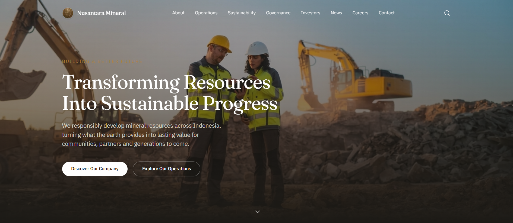
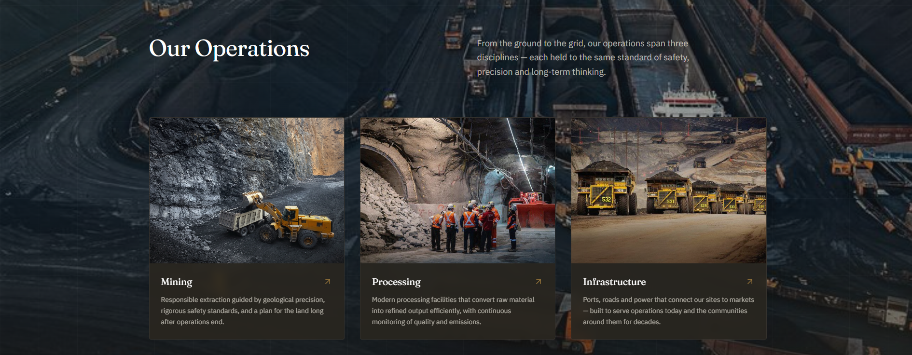
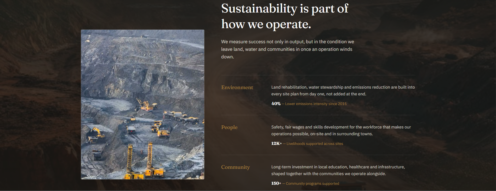

<div align="center">

# Nusantara Mineral

**A premium corporate landing page for a fictional Indonesian mining & energy company.**

[](https://nextjs.org)
[](https://www.typescriptlang.org)
[](https://tailwindcss.com)
[](https://www.framer.com/motion)
[](#license)

</div>

---

## About

**Nusantara Mineral** is a fictional mining, processing and infrastructure
company created as a design and front-end engineering case study. The goal
was to build a single-page corporate website with the visual weight,
storytelling and information architecture of a large industrial/energy
company — premium, editorial, and unmistakably *corporate* rather than a
generic SaaS template.

The page structure and general narrative flow were inspired by real
corporate mining websites, but every line of code, copy, illustration and
visual identity in this repository is original.

> This is a portfolio/learning project. Nusantara Mineral is not a real
> company, and no content here should be treated as factual.

## Preview

**Hero**


**Our Operations**


**Sustainability**


## Features

- **Sticky, transparent-to-solid navbar** with a full-screen mobile menu
- **Fullscreen hero** with a slow background zoom and staggered copy reveal
- **Editorial two-column "About" section** with a sticky heading and a
  four-metric stat row
- **Operations** — three interactive cards (Mining, Processing,
  Infrastructure) with image zoom, lift and arrow-shift on hover
- **Sustainability** — asymmetric layout with a sticky image and three
  pillars (Environment, People, Community), each carrying an impact stat
- **Governance** — annual-report-style numbered pillars (Leadership,
  Ethics & Compliance, Risk Management)
- **Investors** — a minimal, bordered resource list (reports, financials,
  share information, presentations)
- **Careers** banner with a full-bleed background and a single clear CTA
- **Latest News** grid with category, date and a "Read more" affordance
- **Closing CTA** on a solid brand-green background
- **Footer** with grouped navigation, social links and legal line
- Scroll-triggered reveal animations throughout (Framer Motion), respecting
  `prefers-reduced-motion`
- Fully responsive from mobile through large desktop
- Semantic HTML, keyboard-accessible navigation, visible focus states

## Tech Stack

| Layer          | Choice                                      |
| -------------- | -------------------------------------------- |
| Framework      | [Next.js 16](https://nextjs.org) (App Router) |
| Language       | TypeScript                                   |
| Styling        | Tailwind CSS 4                               |
| Animation      | Framer Motion                                |
| Icons          | lucide-react                                 |
| Data           | Local static TypeScript modules (no backend/database) |
| Linting        | ESLint (`eslint-config-next`)                |

No backend, database or CMS is used in this version — all content is
defined in typed data files under `data/`, making it straightforward to
wire up a headless CMS or API later without touching component markup.

## Project Structure

```
nusantara-mineral/
├── app/
│   ├── layout.tsx        # Root layout, fonts, metadata
│   ├── page.tsx          # Assembles all sections in order
│   └── globals.css       # Design tokens (colors, type, focus states)
├── components/
│   ├── Navbar.tsx
│   ├── Hero.tsx
│   ├── About.tsx
│   ├── Operations.tsx
│   ├── Sustainability.tsx
│   ├── Governance.tsx
│   ├── Investors.tsx
│   ├── Careers.tsx
│   ├── News.tsx
│   ├── CTA.tsx
│   └── Footer.tsx
├── data/
│   ├── site.ts             # Nav links, footer columns, social links
│   ├── about.ts             # Company Introduction copy + stats
│   ├── operations.ts        # Operations cards
│   ├── sustainability.ts    # Sustainability pillars
│   ├── governance.ts        # Governance pillars
│   ├── investors.ts         # Investor resource list
│   └── news.ts              # News articles
├── lib/
│   └── fonts.ts             # Fraunces (display) + IBM Plex Sans (body)
└── public/
    └── images/               # Section imagery
```

Each section lives in its own component and pulls its copy from a matching
file in `data/`, so content can be edited without touching layout or
animation code.

## Design System

| Token           | Value                | Usage                            |
| --------------- | -------------------- | ---------------------------------- |
| `charcoal`      | `#1C1A16`             | Primary dark ground                |
| `charcoal-soft` | `#29261F`             | Secondary dark surfaces            |
| `stone`         | `#F1EDE2`             | Primary light ground                |
| `moss`          | `#3D4F3A`             | Brand green (accents, CTA)          |
| `ochre`         | `#A9813E`             | Sparingly used gold/olive accent    |
| Display type    | `Fraunces`            | Headlines (editorial serif)         |
| Body type       | `IBM Plex Sans`       | Body copy and UI                    |

Dark and light sections alternate down the page to keep the long scroll
visually paced, in the manner of an annual report.

## Getting Started

```bash
# 1. Clone the repository
git clone https://github.com/MaulanaYusufzidan/nusantara-mineral.git
cd nusantara-mineral

# 2. Install dependencies
npm install

# 3. Run the development server
npm run dev
```

Open [http://localhost:3000](http://localhost:3000) to view it.

## Available Scripts

| Command         | Description                          |
| --------------- | ------------------------------------- |
| `npm run dev`   | Start the local development server    |
| `npm run build` | Create a production build             |
| `npm run start` | Serve the production build            |
| `npm run lint`  | Run ESLint                             |

## Roadmap

- [ ] Individual detail pages for Operations and News articles
- [ ] Contact form (currently a `mailto:` link)
- [ ] CMS or API integration to replace static `data/` files
- [ ] Automated image optimization pipeline for section imagery

## License

This project is licensed under the [MIT License](LICENSE) — feel free to
use it as a reference or starting point for your own work.

## Author

Built by **Maulana Yusuf Zidan**.
